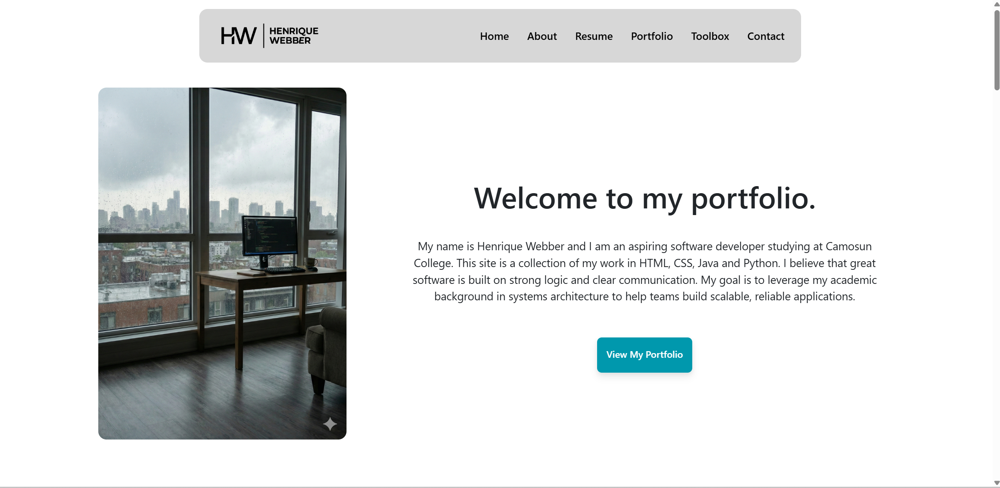

# Professional Web Portfolio 

A responsive, modern portfolio website built to showcase my technical skills and academic projects. This was my Final Project for the web development module in the Information and Computer Systems program at Camosun College.

[🔗 View Live Demo] ()

## Project Goals
* **Professional Presence:** Created a central hub for recruiters to view my resume.
* **Responsive Architecture:** Built from the ground up to be fully mobile-friendly.
* **Semantic HTML:** Focused on clean, accessible code for better SEO and structure.

## Skills
* **Language:** HTML5 & CSS3.
* **Framework:** Bootstrap 5 (Grid, Components, and Utilities).
* **Styling:** Custom CSS for unique branding and layout adjustments.

## Key Features
* **Navigation Bar:** Fixed, responsive header for easy site navigation.
* **Project Cards:** Organized display of my technical work using Bootstrap's card components.
* **Contact Section:** Clean layout for professional inquiries and social links.

---
*Developed by Henrique as a Final Project at Camosun College (Fall 2025).*

